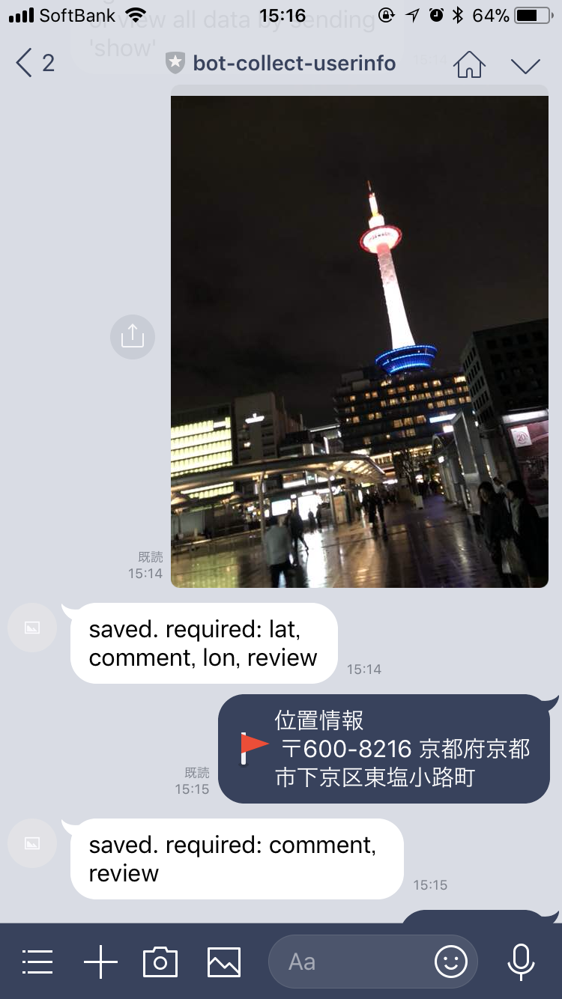
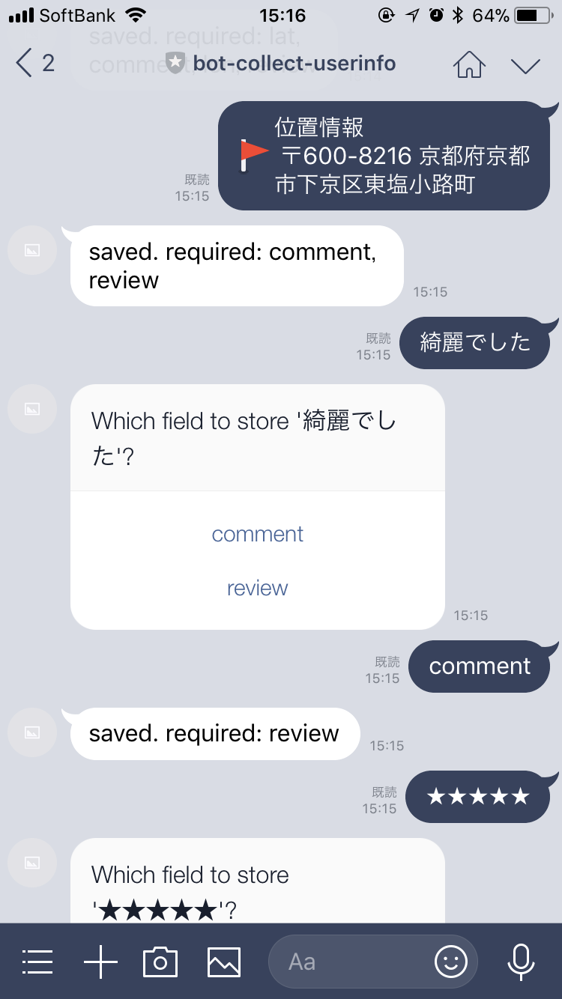
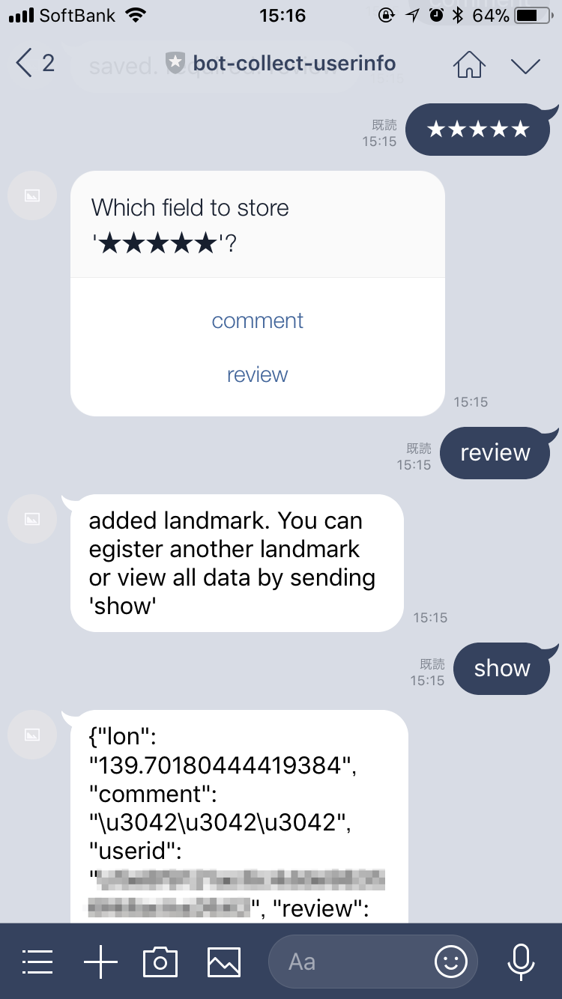

# Example project of Heroku + Node.js + Redis + LINE Bot.

* Can attach multiple information to one userid using LINE.
* Can register multiple structure per user.
* No SQL.
* No create table.

## Usage

### Secret and Channel Access Token of LINE Messaging API

Add Config Variables at Heroku.

* CHANNEL_SECRET => YOUR_CHANNEL_SECRET
* CHANNEL_ACCESS_TOKEN => YOUR_CHANNEL_ACCESS_TOKEN

Get them at [LINE Developers site](https://developers.line.me/).

### Required information of Cloudinary

Add Config Variables at Heroku.

* CLOUDINARY_KEY
* CLOUDINARY_URL
* CLOUDINARY_SECRET
* CLOUDINARY_NAME

Get them at [Cloudinary](https://cloudinary.com/).

### Heroku

Resources > Add-ons > Search 'Heroku Redis' > Provision. No need to create table like when using RDBMS.

Deploy this project then set webhook endpoint to deployed URL at [LINE Developer Center](https://developers.line.me/) to run.
